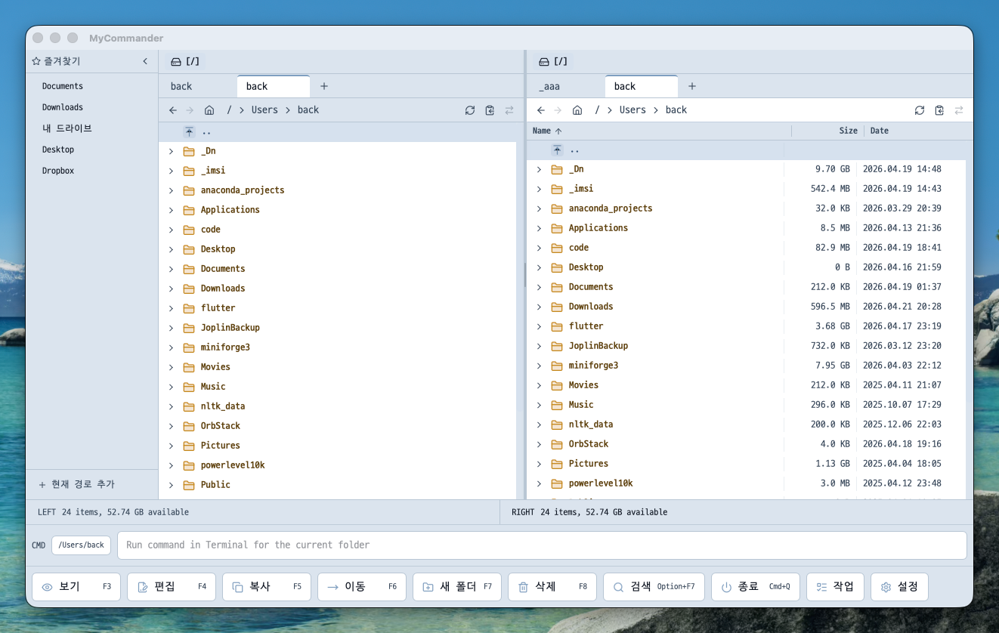

# MyCommander

MyCommander는 **Tauri v2 + React 19 + TypeScript**로 만든 크로스플랫폼 데스크톱 파일 매니저입니다.  
현재 구현은 듀얼 패널 탐색을 중심으로, **고급 검색**, 빠른 미리보기, 일괄 이름 변경, ZIP 작업, 폴더 비교 기능, 패널 간 드래그 드롭 복사 UX, 토스트 기반 피드백까지 포함합니다.



## 주요 기능

- 좌/우 **듀얼 패널** 파일 탐색
- 패널별 **탭**, 뒤로/앞으로 이동, breadcrumb 경로 이동
- **즐겨찾기 패널** 추가 / 이름 변경 / 재정렬 / 접기
- 파일/폴더 **생성, 삭제, 이름 변경, 복사, 이동**
- 패널 간 **드래그 드롭 복사**
- 같은 패널 안에서 폴더만 선택한 경우 **드래그 이동**
- 같은 폴더를 보는 양쪽 패널의 **자동 동기 갱신**
- macOS에서 **Dropbox / iCloud Drive / CloudStorage symlink 경로 탐색 지원**
- **빠른 미리보기**와 텍스트/문서 계열 렌더링
- 정규식 / 대소문자 / 숨김 파일 / 파일 유형 / 확장자 / 크기 / 수정일 범위를 지원하는 **고급 파일 검색**
- 검색 결과 **복사 / 이동 / 삭제**
- **일괄 이름 변경**
- **ZIP 생성 / ZIP 압축 해제**
- **폴더 비교** 기반 동기화 보조 다이얼로그
- 현재 폴더 기준 **터미널 명령 실행**
- 앱 메뉴 / 컨텍스트 메뉴 / 단축키 연동
- 짧은 사용자 피드백을 위한 **토스트 알림**
- **자동 테마 전환**: 07:00–19:00 light, 그 외 dark 자동 적용. 수동으로 light / dark / auto 선택 가능

## 미리보기 지원 예시

현재 코드 기준으로 다음 계열의 파일을 미리보기에 대응합니다.

- 이미지
- 비디오
- PDF
- 일반 텍스트 / 소스 코드 하이라이팅
- R script (`.R`)
- Markdown 렌더링
- HTML 렌더링
- Excel (`.xlsx`, `.xls`)
- Word (`.docx`)
- Jupyter Notebook (`.ipynb`)
- PowerPoint (`.pptx`)
- HWPX

지원하지 않는 형식은 미리보기에서 unsupported 상태로 표시됩니다.

## 기술 스택

- **Frontend**: React 19, TypeScript, Vite, Zustand
- **Styling**: Tailwind CSS v4
- **Desktop Shell**: Tauri v2
- **Backend**: Rust
- **UI**: Radix UI, Lucide React
- **Virtualized List**: `@tanstack/react-virtual`
- **Tests**: Vitest, Testing Library

## 요구 환경

- Node.js 20+
- npm
- Rust stable toolchain
- 운영체제별 Tauri 빌드 도구
  - macOS: Xcode Command Line Tools
  - Windows: Visual Studio C++ Build Tools
  - Linux: WebKitGTK 등 Tauri 의존성

## 빠른 시작

### 1. 의존성 설치

```bash
npm install
```

### 2. Rust 체크

```bash
cargo check --manifest-path src-tauri/Cargo.toml
```

### 3. 앱 실행

```bash
npm run tauri dev
```

개발 중 프런트엔드만 빠르게 확인하고 싶다면:

```bash
npm run dev
```

개발 서버 URL은 보통 `http://127.0.0.1:1420` 입니다.

## 주요 명령어

| 용도 | 명령어 |
|---|---|
| 앱 전체 개발 모드 | `npm run tauri dev` |
| 프런트엔드만 실행 | `npm run dev` |
| 프런트엔드 빌드 | `npm run build` |
| TypeScript 타입 체크 | `./node_modules/.bin/tsc --noEmit` |
| 프런트엔드 테스트 | `npm run test` |
| Rust 테스트 | `npm run test:rust` |
| 전체 테스트 | `npm run test:all` |
| 테스트 커버리지 | `npm run test:coverage` |
| Rust 체크 | `cargo check --manifest-path src-tauri/Cargo.toml` |
| 배포 빌드 | `npm run tauri build` |

## 단축키 / 주요 액션

현재 코드 기준으로 대표 단축키는 다음과 같습니다.

- `Tab`: 활성 패널 전환
- `F3`: 보기
- `F4`: 편집
- `Shift+F4`: 새 파일
- `F5`: 복사
- `F6`: 이동
- `F7`: 새 폴더
- `Alt+F7` / `Option+F7`: 검색
- `F8`: 삭제
- `Cmd+Q` / `Alt+F4`: 앱 종료
- `CmdOrCtrl+Shift+.`: 숨김 파일 표시 토글
- `CmdOrCtrl+Shift+M`: 반대 패널을 현재 경로로 동기화
- `CmdOrCtrl+U`: 패널 교환

## 드래그 드롭 동작

- 같은 패널 안에서 **파일 드래그**는 복사합니다.
- 같은 패널 안에서 **폴더만 선택한 드래그**는 이동으로 처리합니다.
- 왼쪽 패널에서 오른쪽 패널, 또는 반대로 드롭하면 대상 패널 현재 폴더로 복사합니다.
- 이름 충돌이 없으면 즉시 복사합니다.
- 이름 충돌이 있으면 복사 확인 다이얼로그를 열어 후속 동작을 선택합니다.
- 파일 생성, 삭제, 이름 변경, 복사, 이동 후 양쪽 패널이 같은 폴더를 보고 있으면 함께 갱신됩니다.

## 검색 기능

- 기본 파일명 검색 외에 **고급 옵션 패널**을 열 수 있습니다.
- 현재 코드 기준으로 다음 옵션을 지원합니다.
  - 정규식 사용
  - 대소문자 구분
  - 숨김 파일 포함 여부
  - 파일만 / 폴더만 / 모두
  - 파일명 기준 / 전체 경로 기준 검색
  - 확장자 필터
  - 최소 / 최대 크기
  - 수정일 범위
  - 최대 결과 수
- 검색 결과는 스트리밍 방식으로 누적 표시되며, 선택한 결과를 바로 복사 / 이동 / 삭제할 수 있습니다.

## 피드백 표시

- 짧은 작업 피드백(예: 경로 복사, 복사 완료, 경고, 오류)은 **토스트 알림**으로 표시됩니다.
- 오래 걸리는 작업의 진행 상태는 **ProgressDialog**가 담당합니다.
- 작업 이력, 실패 내역, 재시도는 **JobCenterDialog**에서 확인합니다.

## macOS CloudStorage 경로

macOS의 `~/Dropbox` 같은 symlink 경로도 탐색할 수 있습니다.

## 프로젝트 구조

```text
src/
  components/
    dialogs/       # 검색, 미리보기, 복사/이동, 동기화, 일괄 이름 변경 UI + dialog/search helper
    favorites/     # 즐겨찾기 사이드바
    layout/        # 상태바, 컨텍스트 메뉴, 하단 액션, 토스트 뷰포트
    panel/         # 듀얼 패널, 파일 목록, 주소창, 탭, 드라이브 목록 + drag helper
  features/        # 기능 단위 로직
  hooks/           # 키보드 및 Tauri command wrapper
  store/           # Zustand 스토어 + persistence/refresh/toast helper
  test/            # 테스트 설정 / mock
  types/           # 타입 정의
  utils/           # 포맷/경로/클립보드 유틸

src-tauri/
  src/commands/
    fs/            # 파일 시스템 관련 command 하위 모듈
    jobs/          # Job Engine 상태/실행/영속화 하위 모듈
    system/        # 드라이브, 경로, 메뉴, 실행 관련 하위 모듈
    *.rs           # file watch, search, sync, drag 같은 독립 command
  capabilities/    # Tauri capability 정의
  permissions/     # 명령 권한 설정
  tauri.conf.json  # Tauri 앱 설정
```

구현 컨텍스트와 내부 구조 설명은 [CLAUDE.md](./CLAUDE.md), 작업 규칙과 검증 규칙은 [AGENTS.md](./AGENTS.md)에 정리되어 있습니다.

## 버전 업데이트

프로젝트 루트의 [`version-sync.cjs`](./version-sync.cjs)가 `package.json` 버전을 `src-tauri/tauri.conf.json`에 동기화합니다.

일반적인 릴리스 흐름:

```bash
git add -A
git commit -m "release: prepare next version"
npm version <new-version>   # 예: 1.1.22
git push origin main
git push origin v<new-version>
```

`npm version` 실행 시:

- `package.json` 버전이 변경됩니다.
- `version-sync.cjs`가 `src-tauri/tauri.conf.json` 버전을 함께 맞춥니다.
- Git 태그가 로컬에 생성됩니다.
- 원격 브랜치와 태그 push는 자동으로 하지 않습니다.

필요하면 명시적으로 다음 스크립트로 브랜치와 태그를 함께 push할 수 있습니다.

```bash
npm run release:push
```

릴리스 GitHub Actions는 `v*` 형식의 태그 push 또는 수동 실행(`workflow_dispatch`)으로 시작됩니다.

과거 릴리스 과정에서 생성된 `app-v*` 태그는 legacy 호환용으로 유지합니다. 새 릴리스에서는 `v*` 태그만 사용하며, 더 이상 `app-v*` 태그를 새로 만들지 않습니다.

현재 릴리스 하네스는 다음 순서로 동작합니다.

- `check`: TypeScript 타입 체크와 Rust 체크
- `test`: 프런트엔드 테스트와 Rust 테스트
- `build`: 프런트엔드 프로덕션 빌드
- `publish-tauri`: 위 단계를 모두 통과한 뒤 플랫폼별 Tauri 배포 빌드

GitHub Actions 워크플로 또는 로컬 composite action을 수정할 때는 별도 `actionlint` 워크플로가 먼저 YAML과 액션 구성을 검증합니다.

## 문제 해결

### 포트 1420 충돌

```bash
lsof -ti tcp:1420 | xargs kill
```

### Vite 관련 파일 누락/설치 손상

```bash
rm -rf node_modules
npm install
```

### 빌드 산출물 용량이 너무 커질 때

```bash
cargo clean --manifest-path src-tauri/Cargo.toml
```

`src-tauri/target/`은 매우 커질 수 있습니다.

### 빌드/권한 이슈가 있을 때

- 루트의 `build_log.txt` 확인
- `src-tauri/permissions/`와 `src-tauri/capabilities/` 확인
- `src-tauri/tauri.conf.json` 확인

## 참고1

- 프로젝트 컨텍스트 문서는 [CLAUDE.md](./CLAUDE.md)
- 작업 규칙과 검증 규칙은 [AGENTS.md](./AGENTS.md)
